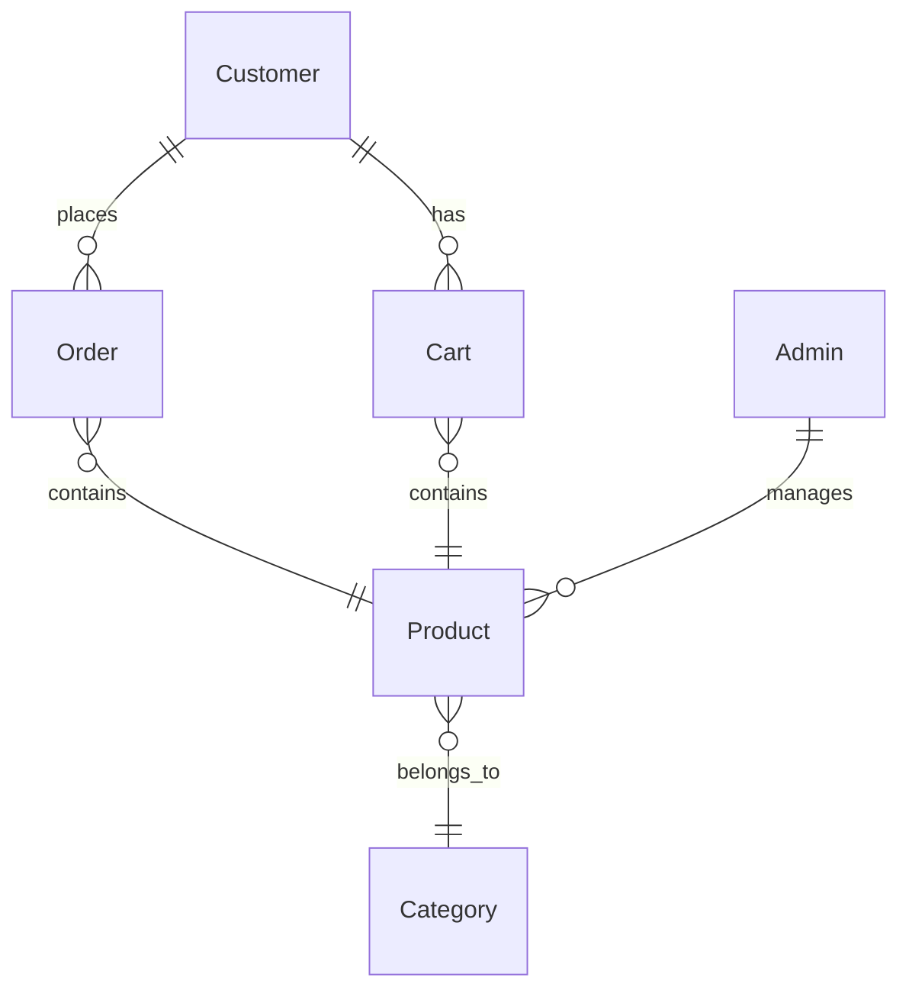

# Shope Ease

**Shope Ease** is a robust, full-featured e-commerce web platform built with ASP.NET MVC, C#, HTML, and CSS. It supports product catalog browsing, shopping cart, order management, rich admin dashboards, and tailored customer experiences such as gaming, work-from-home, entertainment, and smart living.

---

## Table of Contents

- [Project Overview](#project-overview)
- [Features](#features)
- [Demo & Screenshots](#demo--screenshots)
- [Architecture](#architecture)
- [Technical Specifications](#technical-specifications)
- [Database Schema](#database-schema)
- [API Routes](#api-routes)
- [User and Admin Flows](#user-and-admin-flows)
- [Getting Started](#getting-started)
- [Documentation](#documentation)
- [Contributing](#contributing)
- [License](#license)

---

## Project Overview

shope ease is designed for flexibility and ease of management, allowing admins to efficiently handle inventory and customer orders, while providing users with curated shopping experiences.

---

## Features

- **Product Catalog:** Browse, filter, and search products; organized by categories.
- **Curated Experiences:** Special bundles for Gaming, Work From Home, Smart Living, Entertainment.
- **Shopping Cart:** Add/remove items, checkout seamlessly.
- **Order Management:** Place orders and view order history.
- **Admin Dashboard:** Manage products, categories, users; edit/add/delete functions.
- **Customer Management:** View and manage user profiles.
- **Secure Authentication:** Session-based admin and user login/logout.
- **Responsive Design:** Works on all devices, modern UI (Bootstrap, custom CSS).
- **Image Uploading:** Admins can upload/manage product images.

---

## Demo & Screenshots

> _Add screenshots or animated GIFs here for user/admin panel, product catalog, dashboard view, and curated experiences._

---

## Architecture

**Tech Stack:**  
- Backend: ASP.NET Core MVC (C#)
- Frontend: HTML5, CSS3, Razor Views
- Database: SQL Server (Entity Framework Core ORM)
- Web Server: Kestrel, IIS compatible

**Project Structure:**
- `/Controllers`: App logic (Admin, User, Product, Order)
- `/Models`: Data models and view models
- `/Views`: User/Admin Razor pages
- `/Product_images`: Uploaded product images
- `/docs`: General and tech documentation

For technical details see [docs/tech-specs.md](docs/tech-specs.md).

---

## Technical Specifications

- .NET 6 SDK
- Entity Framework Core for data access
- Session management with ASP.NET
- Bootstrapped and custom CSS & icons
- Admin functions for product/category/user/order handling
- Code samples: [docs/code-samples.md](docs/code-samples.md)

See [docs/tech-specs.md](docs/tech-specs.md) for full details.

---

## Database Schema

Main entities: Customer, Product, Order, Category, Admin, Cart.

Visual schema and entity overview:  
  


See [docs/db-schema.md](docs/db-schema.md) for full schema.

---

## API Routes

| Route                        | Method | Purpose                         |
|------------------------------|--------|---------------------------------|
| `/User/Shop`                 | GET    | Product browsing                |
| `/Admin/FetchProduct`        | GET    | Admin product management        |
| `/User/BuyNow/{id}`          | GET    | Direct buy flow                 |
| `/User/ConfirmOrder`         | POST   | Place order                     |
| `/Admin/AddProduct`          | GET/POST | Add new product                |

Full routes: [docs/api-routes.md](docs/api-routes.md)

---

## User and Admin Flows

**User Journey:**
- Browse products/experiences
- Add to cart or buy now
- Checkout, view orders, manage profile

**Admin Journey:**
- Login
- Manage products/categories/users
- View/edit/delete orders

Visual diagrams: [docs/user-flow.md](docs/user-flow.md)

---

## Getting Started

### Prerequisites

- .NET 6 SDK
- SQL Server
- Visual Studio or VS Code

### Setup Steps

1. Clone repo:
    ```sh
    git clone https://github.com/muhammad-huzaifa-ali/shope-ease.git
    ```
2. Configure `appsettings.json` with your database connection.
3. Restore packages:
    ```sh
    dotnet restore
    ```
4. Run with:
    ```sh
    dotnet run
    ```
    Or use Visual Studio.

For detailed setup, see [docs/install.md](docs/install.md).

---

## Documentation

- [Introduction](docs/intro.md)
- [Install Guide](docs/install.md)
- [Feature Breakdown](docs/feature-breakdown.md)
- [Technical Specs](docs/tech-specs.md)
- [Database Schema](docs/db-schema.md)
- [API Routes](docs/api-routes.md)
- [User Flow Diagram](docs/user-flow.md)
- [Code Samples](docs/code-samples.md)

---

## Contributing

Pull requests and issue reports are welcome.
Please see [docs/feature-breakdown.md](docs/feature-breakdown.md) for roadmap and contribution guidelines.

---

## License

Specify your license here, e.g. MIT.

---

## Contact

For questions or consulting, reach out via GitHub Issues.
