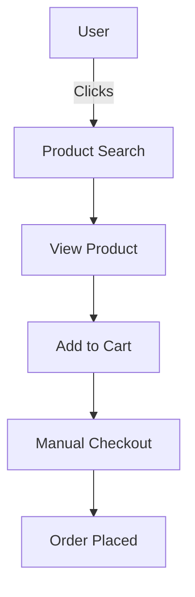

# 🚀 Roadmap & Future Integrations

This roadmap outlines the vision for evolving **shope ease** into a next-generation, agentic, AI-powered shopping platform.

---

## 🗺️ Strategic Vision

Build shope ease into a smart, human-friendly, and highly automated e-commerce agent—where users shop as they would with a real assistant, using natural language, voice, and proactive recommendations.

---

## 🗓️ Roadmap Phases

### Phase 1: Conversational AI Assistant
- Multilingual voice & chat: natural language search and product queries.
- Integration: [OpenAI GPT-4](https://openai.com), Whisper, Azure Speech, Web Speech API.

### Phase 2: Agentic Recommendation & Filtering
- User states needs, AI agent suggests best-fit products ("smartphone under $300").
- Personalized, context-aware suggestions.

### Phase 3: AI-Powered Automated Checkout
- After selecting, agent gathers/shares checkout info & confirmation.
- Voice or chat-driven purchase: “Yes, buy for me.”

### Phase 4: Real-Time Comparison/Scraping
- Compare products with real-time scraping or APIs of competitor sites.

### Phase 5: Sentiment-Aware Shopping
- Sentiment detected from user voice/text.
- Suggestions and UI adapt to user's mood.

---

## 🏗️ Tech Specs, Architecture, Models

| Feature                  | Tech / API            | Model / Approach        |
|--------------------------|-----------------------|------------------------|
| Voice Recognition        | Web Speech API, Whisper, Azure TTS | Multilingual ASR |
| NLU / Search Assistant   | OpenAI GPT-4, Azure | LLM w/ semantic search |
| Recommendation Agent     | OpenAI (fine-tuned), custom ML | Product graph, embeddings |
| Sentiment Analysis       | Azure/Speech, OpenAI  | Pretrained sentiment   |
| Comparison/Scraping      | Scrapy (Py), Puppeteer | Web data extraction    |

Main language: **C# (backend)**, **JavaScript (client/voice)**, **Python/Node.js** (AI modules).

Models hosted via cloud endpoints or integrated microservices.

---

## 🕸️ Architecture Evolution

### Before AI/Agentic Integration



### After AI/Agentic Integration

```mermaid
flowchart TD
    UA[User (Voice/Chat)] --> AG[Agent/AI Assistant]
    AG --> RP[Agent Recommends/Suggests]
    RP --> PC[Agent Prepares Cart]
    PC --> CO[Confirms with User]
    CO --> OP[Order Placed]
    subgraph AI
    AG
    end
```

---

## 📊 Feature Comparison Table

|                   | Classic    | Agentic/AI  |
|-------------------|------------|-------------|
| Search            | Manual     | Voice/Chat  |
| Discovery         | Browse     | AI-guided   |
| Adding to Cart    | Manual     | Automated   |
| Checkout          | Forms      | AI/completed|
| Comparison        | None       | Real-time   |
| Sentiment-aware   | No         | Yes         |
| Language Support  | Set        | Any/built-in|

---

## 📅 Timeline & Milestones

- **Q2 2026:** Prototype AI assistant beta (voice/chat)
- **Q3 2026:** Smart recommendations & AI checkout pilot
- **Q4 2026:** Real-time comparison scraping & final UI

---

## 🔗 See Also

- [Technical Specs](./tech-specs.md)
- [Feature Breakdown](./feature-breakdown.md)
- [User Flow (Before/After)](./user-flow.md)
- [API & Routes](./api-routes.md)
