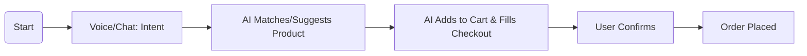

# 🚀 Roadmap & Future Integrations

This document outlines the planned and proposed enhancements for **shope ease**, with a special focus on leading-edge agentic/AI functionalities.

---

## 🗓️ Overview

We aim to evolve shope ease from a classic e-commerce platform to a smart, agent-assisted, and personalized shopping experience.

---

## 🔥 Planned & Proposed Features

### Phase 1: Conversational AI Assistant
- **Voice and Chat Search:** Users can find products or get recommendations through voice (any language) or chat.
- **Tech:** Web Speech API, OpenAI GPT API, Node.js backend integration, multi-language NLP.

### Phase 2: Smart Product Recommendation Agent
- **Personalized recommendation via need/budget/purpose stated in natural language.**
- **Tech:** Fine-tuned language model, product knowledge graph.

### Phase 3: Automated End-to-End Checkout
- **AI agent completes checkout, fills all info, and suggests payment/shipping options automatically.**
- **Tech:** Integration of voice commands with checkout workflow and profile prediction.

### Phase 4: Real-Time Product Comparison
- **Scrape competing websites and show price/spec comparisons live.**
- **Tech:** Python/Node scripts, third-party APIs.

### Phase 5: Sentiment-Aware Shopping
- **Detect mood from voice and adapt suggestions/UI accordingly.**
- **Tech:** Speech sentiment models (OpenAI, Azure, Whisper, etc.)

---

## 🏗️ Planned Tech Specs, Architecture, and Models

| Feature                 | Tech / API                   | Model / Approach        |
|-------------------------|------------------------------|------------------------|
| Voice Search            | Web Speech API (client), Whisper ASR, Azure, Google Cloud | Open-source/Cloud      |
| Multilingual Support    | Google Translate, Azure Translation | NLU pipelines         |
| Smart Recommendations   | OpenAI GPT-4, Custom ML      | Semantic search + user profile |
| Sentiment Analysis      | OpenAI, Azure Speech         | Voice sentiment models |
| Web Scraping            | Scrapy (Python), Puppeteer   | NA                     |
| AI Checkout             | GPT agent, Google Actions API| Goal-oriented agent    |

- **Main language & frameworks:** C# (backend), JS (frontend), Python/Node.js for AI glue modules.
- **Model Hosting:** Cloud endpoints for heavy AI, local plugins for interactive UI.

---

## 🕸️ Architecture Evolution

> _Before Integration:_

- User searches, adds to cart, checks out through multi-click UI flows.
- All product filtering/selection manual.
- Checkout data entry is manual, step-by-step.

> _After Integration:_

- User talks to or chats with AI agent.
- “I want a gaming mouse under $50,” agent filters, recommends, adds to cart.
- AI asks for confirmation, auto-completes checkout with stored profile.
- Voice, chat, and text all supported.

---

## 📊 User Flow Comparison

### **Before (Classic Flow)**

### **Agentic/AI-Integrated (Future Flow)**

---

## 📅 Timeline

- **Q2 2026:** Prototype voice search, launch as beta
- **Q3 2026:** Integrated recommendations, sentiment/mood pilot
- **Q4 2026:** Full AI checkout and finalist product comparison

---

## 🌱 Why This Roadmap?

- Elevate user experience
- Minimize friction and clicks
- Make shopping accessible to all, regardless of language or ability

---

## 🤝 Contribute or Collaborate

Ideas, feedback, and PRs are welcome! See [docs/feature-breakdown.md](./feature-breakdown.md) for existing features and how to get involved.
