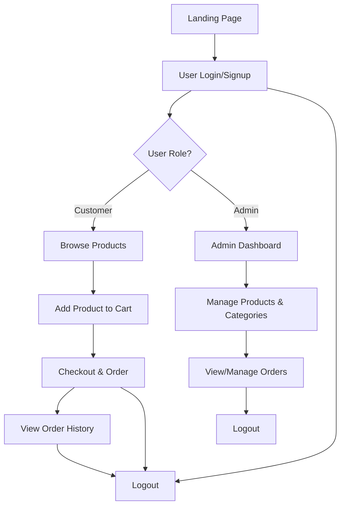

# User Flow

This diagram illustrates a typical user journey:

```mermaid
flowchart TD
    A[Landing Page] --> B[User Login/Signup]
    B --> C{User Role?}
    C -- Customer --> D[Browse Products]
    D --> E[Add Product to Cart]
    E --> F[Checkout & Order]
    F --> G[View Order History]
    C -- Admin --> H[Admin Dashboard]
    H --> I[Manage Products & Categories]
    I --> J[View/Manage Orders]
    J --> K[Logout]
    G --> L[Logout]
    F --> L
    B --> L
```

- **Customer**: Can shop, order, see history.
- **Admin**: Can add/edit/delete, see orders, manage shop.
